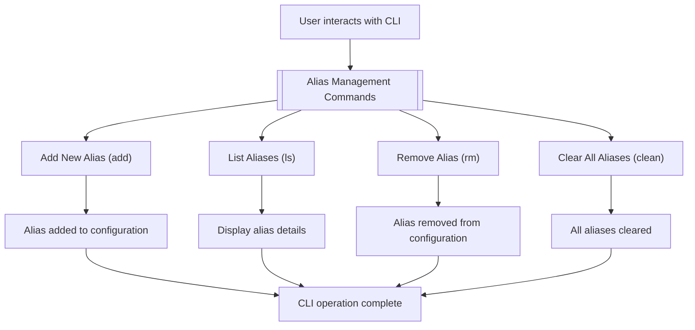

# Alias Management

This section provides a detailed guide on managing your custom aliases within `to-where-cli`. You'll learn how to add new aliases, list existing ones, remove specific aliases, and clear all stored aliases. Understanding these commands is crucial for effectively using `to-where-cli` to navigate your system.

For an overview of all commands, refer to the [Command Reference](./command-reference.md) section.



## Add Alias

The `add` command allows you to define a new alias for a specific directory path. This creates a shortcut that you can later use with the `to-where-cli` tool to quickly navigate to that location.

### Usage

`tw add [alias] [address]`

### Parameters

| Name | Type | Description |
|---|---|---|
| `alias` | `string` | Optional. The custom name you want to assign to the directory path. If omitted, `to-where-cli` will use the name of the current working directory as the alias. |
| `address` | `string` | Optional. The directory path you want to associate with the alias. If omitted, `to-where-cli` will use the current working directory. |
| `-f`, `--force` | `boolean` | Optional. Use this flag to overwrite an existing alias if one with the same name already exists. By default, `to-where-cli` will prevent overwriting. |

### Example

To add an alias named `myproject` for the current directory:

```bash
tw add myproject
```

This command adds an alias `myproject` pointing to your current working directory. If you are in `/home/user/projects/myproject`, the alias `myproject` will point to `/home/user/projects/myproject`.

To add an alias named `dev` for a specific path `/Users/johndoe/development`:

```bash
tw add dev /Users/johndoe/development
```

This command creates an alias `dev` that points to the `/Users/johndoe/development` directory.

To overwrite an existing alias `work` with a new path:

```bash
tw add work /new/path/to/work --force
```

This command will update the `work` alias to point to `/new/path/to/work`, even if `work` was previously defined.

### Example Output

```
info Added successfully
info myproject => /home/user/projects/myproject => 0
```

## List Aliases

The `ls` command displays information about your stored aliases and their associated directory paths. You can list all aliases or check the details of a specific alias.

### Usage

`tw ls [alias]`

### Parameters

| Name | Type | Description |
|---|---|---|
| `alias` | `string` | Optional. Specify the name of an alias to view its details. If this parameter is omitted, `to-where-cli` will list all existing aliases. |

### Example

To list all currently stored aliases:

```bash
tw ls
```

This command will display a list of all your aliases, their paths, and their visit counts.

To check the details of a specific alias, for example, `myproject`:

```bash
tw ls myproject
```

This command will show only the information for the `myproject` alias.

### Example Output

For `tw ls`:

```
info myproject => /home/user/projects/myproject => 5
info dev => /Users/johndoe/development => 3
info docs => /home/user/documents => 2
```

For `tw ls myproject`:

```
info myproject => /home/user/projects/myproject => 5
```

## Remove Alias

The `rm` command allows you to delete an alias from your `to-where-cli` configuration. You can specify a single alias to remove, or use an interactive prompt to select multiple aliases for deletion.

### Usage

`tw rm [alias]`

### Parameters

| Name | Type | Description |
|---|---|---|
| `alias` | `string` | Optional. The name of the alias to be removed. If this parameter is omitted, `to-where-cli` will present an interactive selection menu for you to choose aliases to delete. |

### Example

To remove a single alias named `oldalias`:

```bash
tw rm oldalias
```

This command will permanently delete the `oldalias` entry from your configuration.

To interactively select multiple aliases to remove:

```bash
tw rm
```

This will present a prompt where you can use arrow keys and spacebar to select aliases, then press Enter to confirm deletion.

### Example Output

For `tw rm oldalias`:

```
info Alias oldalias has been removed
info oldalias => /path/to/old/project => 1
```

For interactive mode (`tw rm`):

```
? Select the alias to be deleted233
❯◯ myproject => /home/user/projects/myproject => 5
 ◯ dev => /Users/johndoe/development => 3
 ◯ docs => /home/user/documents => 2
```

After selection and confirmation:

```
info Alias myproject has been removed
info myproject => /home/user/projects/myproject => 5
info Deleted successfully!
```

## Clear All Aliases

The `clean` command provides a way to remove all aliases stored in your `to-where-cli` configuration. This action is irreversible and will delete all alias entries.

### Usage

`tw clean`

### Parameters

| Name | Type | Description |
|---|---|---|
| `-f`, `--force` | `boolean` | Required. This flag is mandatory to confirm that you intend to delete all aliases. `to-where-cli` requires this explicit confirmation to prevent accidental data loss. |

### Example

To clear all aliases from your configuration:

```bash
tw clean --force
```

This command will remove every alias you have previously added. If you do not include the `--force` flag, the command will not execute and will inform you of the requirement.

### Example Output

Without `--force`:

```
error To make sure you know what you're doing, you must use '-f' or '--force' to empty
```

With `--force` (no explicit success message for `clean` in current datasources, it implies success by not showing an error):

```
# No output on success, or command simply finishes.
```

---

This section covered the essential commands for managing your aliases with `to-where-cli`. You can now efficiently add, list, remove, and clear your shortcuts. To explore other functionalities, proceed to the [GitHub Utilities](./command-reference-github-utilities.md) section or return to the main [Command Reference](./command-reference.md).