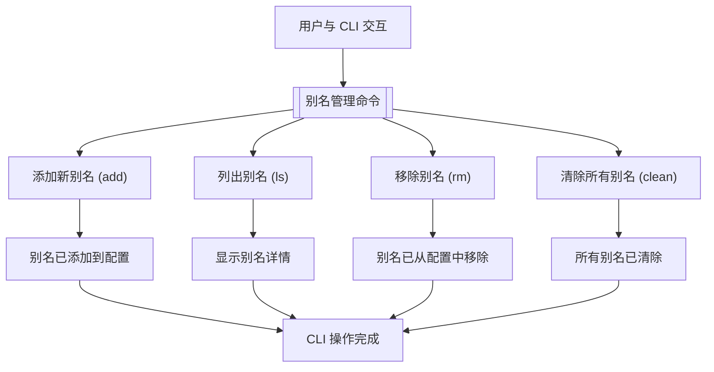

# 别名管理

本节详细介绍了如何在 `to-where-cli` 中管理您的自定义别名。您将学习如何添加新别名、列出现有别名、删除特定别名以及清除所有已存储的别名。了解这些命令对于有效使用 `to-where-cli` 来导航您的系统至关重要。

有关所有命令的概述，请参阅[命令参考](./command-reference.md)部分。



## 添加别名

`add` 命令允许您为特定的目录路径定义一个新别名。这会创建一个快捷方式，您稍后可以使用 `to-where-cli` 工具快速导航到该位置。

### 用法

`tw add [alias] [address]`

### 参数

| Name | Type | Description |
|---|---|---|
| `alias` | `string` | 可选。您希望分配给目录路径的自定义名称。如果省略，`to-where-cli` 将使用当前工作目录的名称作为别名。 |
| `address` | `string` | 可选。您希望与别名关联的目录路径。如果省略，`to-where-cli` 将使用当前工作目录。 |
| `-f`, `--force` | `boolean` | 可选。如果存在同名别名，使用此标志覆盖现有别名。默认情况下，`to-where-cli` 将阻止覆盖。 |

### 示例

为当前目录添加名为 `myproject` 的别名：

```bash
tw add myproject
```

此命令添加一个名为 `myproject` 的别名，指向您的当前工作目录。如果您位于 `/home/user/projects/myproject`，则别名 `myproject` 将指向 `/home/user/projects/myproject`。

为特定路径 `/Users/johndoe/development` 添加名为 `dev` 的别名：

```bash
tw add dev /Users/johndoe/development
```

此命令创建一个指向 `/Users/johndoe/development` 目录的别名 `dev`。

使用新路径覆盖现有别名 `work`：

```bash
tw add work /new/path/to/work --force
```

此命令将更新 `work` 别名以指向 `/new/path/to/work`，即使 `work` 之前已定义。

### 示例输出

```
info 添加成功
info myproject => /home/user/projects/myproject => 0
```

## 列出别名

`ls` 命令显示有关您已存储的别名及其关联目录路径的信息。您可以列出所有别名或检查特定别名的详细信息。

### 用法

`tw ls [alias]`

### 参数

| Name | Type | Description |
|---|---|---|
| `alias` | `string` | 可选。指定要查看其详细信息的别名名称。如果省略此参数，`to-where-cli` 将列出所有现有别名。 |

### 示例

列出所有当前已存储的别名：

```bash
tw ls
```

此命令将显示您所有别名、其路径及其访问计数的列表。

查看特定别名（例如 `myproject`）的详细信息：

```bash
tw ls myproject
```

此命令将仅显示 `myproject` 别名的信息。

### 示例输出

对于 `tw ls`：

```
info myproject => /home/user/projects/myproject => 5
info dev => /Users/johndoe/development => 3
info docs => /home/user/documents => 2
```

对于 `tw ls myproject`：

```
info myproject => /home/user/projects/myproject => 5
```

## 移除别名

`rm` 命令允许您从 `to-where-cli` 配置中删除别名。您可以指定要删除的单个别名，或使用交互式提示选择多个别名进行删除。

### 用法

`tw rm [alias]`

### 参数

| Name | Type | Description |
|---|---|---|
| `alias` | `string` | 可选。要删除的别名名称。如果省略此参数，`to-where-cli` 将呈现一个交互式选择菜单，供您选择要删除的别名。 |

### 示例

删除名为 `oldalias` 的单个别名：

```bash
tw rm oldalias
```

此命令将永久删除配置中的 `oldalias` 条目。

交互式选择要删除的多个别名：

```bash
tw rm
```

这将显示一个提示，您可以使用方向键和空格键选择别名，然后按 Enter 确认删除。

### 示例输出

对于 `tw rm oldalias`：

```
info 别名 oldalias 已被移除
info oldalias => /path/to/old/project => 1
```

对于交互模式 (`tw rm`)：

```
? 选择要删除的别名233
❯◯ myproject => /home/user/projects/myproject => 5
 ◯ dev => /Users/johndoe/development => 3
 ◯ docs => /home/user/documents => 2
```

选择并确认后：

```
info 别名 myproject 已被移除
info myproject => /home/user/projects/myproject => 5
info 删除成功！
```

## 清除所有别名

`clean` 命令提供了一种清除 `to-where-cli` 配置中所有已存储别名的方法。此操作不可逆，将删除所有别名条目。

### 用法

`tw clean`

### 参数

| Name | Type | Description |
|---|---|---|
| `-f`, `--force` | `boolean` | 必填。此标志是强制性的，用于确认您打算删除所有别名。`to-where-cli` 需要此明确确认以防止意外数据丢失。 |

### 示例

清除配置中的所有别名：

```bash
tw clean --force
```

此命令将移除您之前添加的所有别名。如果您不包含 `--force` 标志，该命令将不会执行，并会告知您此要求。

### 示例输出

不带 `--force`：

```
error 为确保您知晓操作后果，必须使用 '-f' 或 '--force' 进行清空
```

带 `--force`（当前数据源中 `clean` 没有明确的成功消息，它通过不显示错误来暗示成功）：

```
# 成功时无输出，或命令简单完成。
```

---

本节涵盖了使用 `to-where-cli` 管理别名的基本命令。您现在可以高效地添加、列出、删除和清除您的快捷方式。要探索其他功能，请前往[GitHub 工具](./command-reference-github-utilities.md)部分或返回主[命令参考](./command-reference.md)。