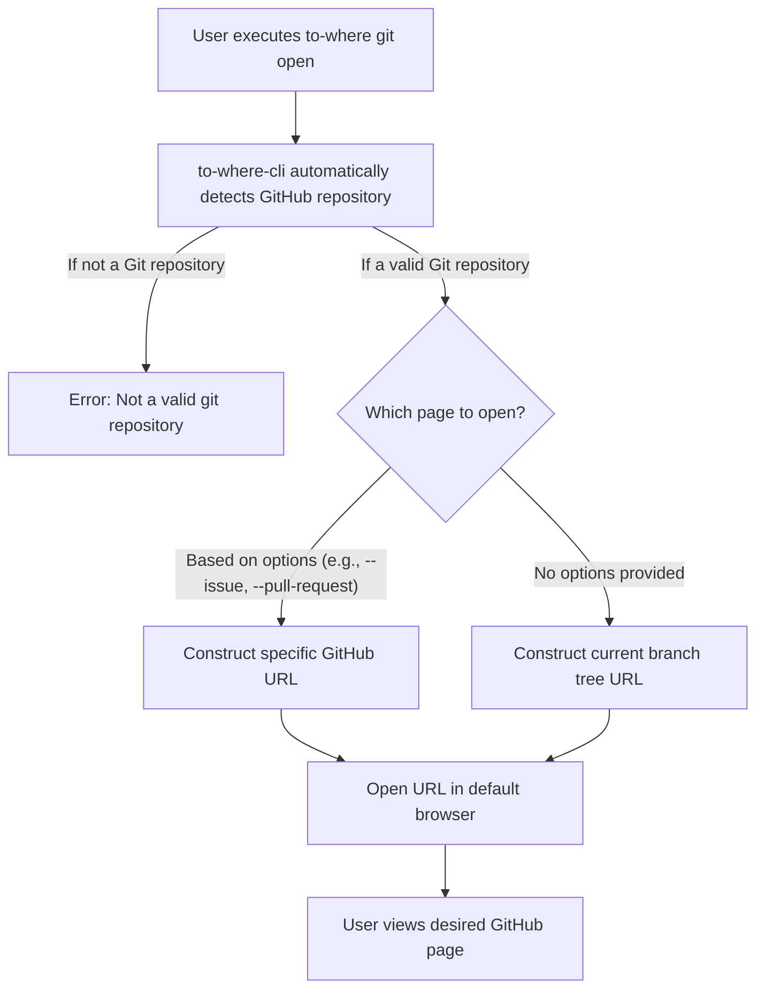

# GitHub Utilities

This section details how to use `to-where-cli`'s dedicated `git` command, which provides quick access to various pages within a GitHub repository. This functionality streamlines your workflow by allowing you to instantly navigate to issues, pull requests, branches, commits, or project settings directly from your terminal.

For general command usage and other `to-where-cli` functionalities, refer to the [Command Reference](./command-reference.md) section.

## Understanding the `git open` Command

The `git` command in `to-where-cli` is primarily used with the `open` subcommand. The `git open` command automatically detects the GitHub remote URL of your current Git repository and constructs the appropriate URL to open in your default web browser based on the options you provide. If no options are specified, it defaults to opening the current branch's tree page.

This process simplifies navigation:



### Command Syntax

```bash
to-where git open [options]
```

### Available Options

The `git open` command supports a variety of options to navigate to different parts of your GitHub repository. The following table describes each option:

| Option | Description | Example Usage | Opens to | Notes |
|---|---|---|---|---|
| `-a, --actions` | Opens the GitHub Actions workflow page. | `to-where git open -a` | `https://github.com/user/repo/actions` | |
| `--author` | Opens the profile page of the current repository's author. | `to-where git open --author` | `https://github.com/author_username` | Requires Git author information in the repository. |
| `-b, --branch [branch]` | Opens the page for a specific branch. If no branch name is provided, it opens the current branch's page. | `to-where git open -b`<br>`to-where git open -b my-feature` | `https://github.com/user/repo/tree/branch_name` | |
| `-c, --commit [hash]` | Opens the page for a specific commit hash. If no hash is provided, it opens the current commit's page. | `to-where git open -c`<br>`to-where git open -c abcdef12` | `https://github.com/user/repo/commit/commit_hash` | |
| `--committer` | Opens the profile page of the last committer. | `to-where git open --committer` | `https://github.com/committer_username` | Requires Git committer information. |
| `-f, --file <filePath>` | Opens the specific file within the repository on GitHub. | `to-where git open -f src/index.ts` | `https://github.com/user/repo/tree/branch_name/file/path` | Opens the file on the current branch. |
| `--find` | Opens the search file page within the repository. | `to-where git open --find` | `https://github.com/user/repo/find/branch_name` | Searches files on the current branch. |
| `--first-commit` | Opens the very first commit page of the repository. | `to-where git open --first-commit` | `https://github.com/user/repo/commit/first_commit_hash` | |
| `-i, --issue` | Opens the issues list page. | `to-where git open -i` | `https://github.com/user/repo/issues` | |
| `-m, --main` | Opens the main repository page (default branch). | `to-where git open -m` | `https://github.com/user/repo` | |
| `-p, --pull-request` | Opens the pull request list page. | `to-where git open -p` | `https://github.com/user/repo/pulls` | |
| `--pull [branch]` | Opens the page to create a new pull request. If a branch name is provided, it suggests a PR from that branch; otherwise, it uses the current branch. | `to-where git open --pull`<br>`to-where git open --pull new-feature` | `https://github.com/user/repo/pull/new/branch_name` | |
| `-r, --release` | Opens the releases page. | `to-where git open -r` | `https://github.com/user/repo/releases` | |
| `-s, --settings` | Opens the repository settings page. | `to-where git open -s` | `https://github.com/user/repo/settings` | Requires appropriate permissions. |
| `--star` | Opens the stargazers page. | `to-where git open --star` | `https://github.com/user/repo/stargazers` | |


### Usage Examples

#### Open Issues Page

To quickly navigate to your repository's issues page:

```bash
to-where git open --issue
```

This command will open your default browser to `https://github.com/<your-username>/<your-repo-name>/issues`.

#### Open Pull Request List

To view all open pull requests for your repository:

```bash
to-where git open --pull-request
```

This command will open your default browser to `https://github.com/<your-username>/<your-repo-name>/pulls`.

#### Open a Specific Branch

To go directly to the file tree of a particular branch, for example, `develop`:

```bash
to-where git open --branch develop
```

This command will open your default browser to `https://github.com/<your-username>/<your-repo-name>/tree/develop`.

If you want to open the page for your current working branch, simply use:

```bash
to-where git open --branch
```

This will open `https://github.com/<your-username>/<your-repo-name>/tree/<current-branch-name>`.

#### Open a Specific File

To view a specific file, such as `README.md`, directly on GitHub:

```bash
to-where git open --file README.md
```

This command will open your default browser to `https://github.com/<your-username>/<your-repo-name>/tree/<current-branch-name>/README.md`.

#### Create a New Pull Request

To initiate the creation of a new pull request from your current branch:

```bash
to-where git open --pull
```

This command will open your browser to a new pull request creation page, pre-filled with your current branch as the source: `https://github.com/<your-username>/<your-repo-name>/pull/new/<current-branch-name>`.

Alternatively, to specify the source branch for the new pull request:

```bash
to-where git open --pull feature/my-new-feature
```

This opens the page for creating a pull request from `feature/my-new-feature` to the default branch.

### Error Handling

If you execute `to-where git open` in a directory that is not a valid Git repository, the command will display an error message and will not open any URL:

```
The current directory is not a valid git repository
```

***

This section has provided a comprehensive guide to using `to-where-cli`'s `git open` command for efficient GitHub navigation. You can now quickly access various parts of your repository directly from the command line. Next, explore how to perform quick searches on popular platforms with `to-where-cli` in the [Search Integrations](./command-reference-search-integrations.md) section.