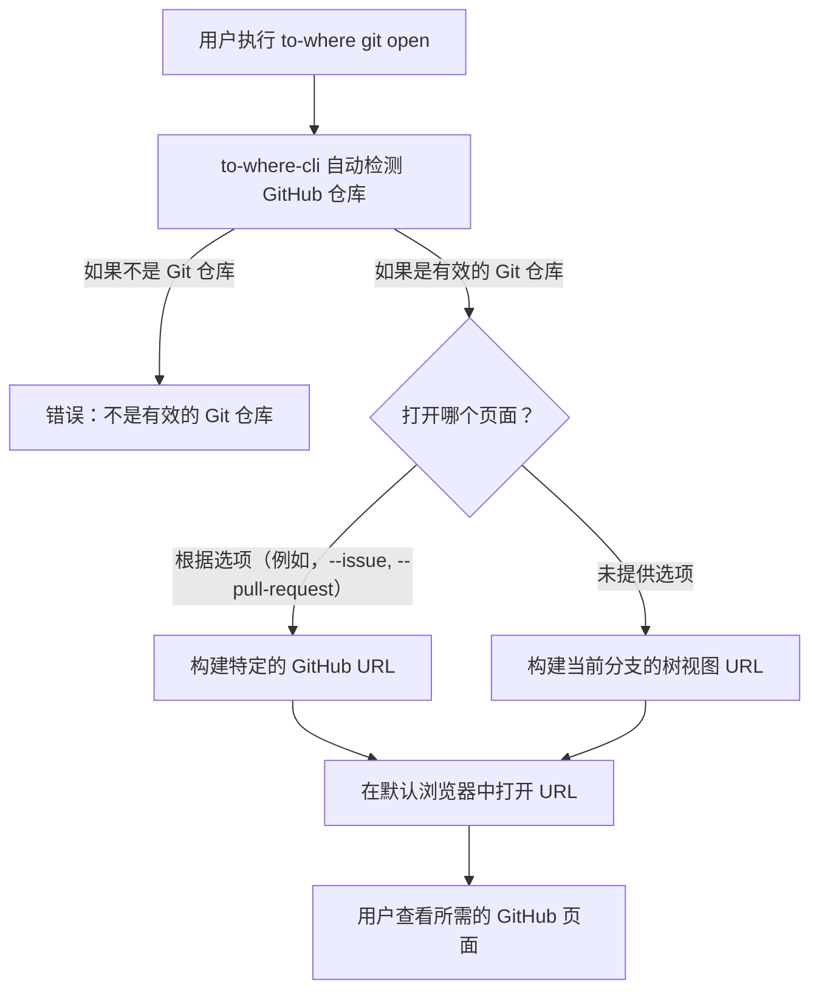

# GitHub 工具

本节详细介绍了如何使用 `to-where-cli` 专门的 `git` 命令，该命令可快速访问 GitHub 仓库中的各种页面。此功能允许您直接从终端即时导航到议题、拉取请求、分支、提交或项目设置，从而简化您的工作流程。

有关通用命令用法和 `to-where-cli` 其他功能的信息，请参阅[命令参考](./command-reference.md)部分。

## 理解 `git open` 命令

`to-where-cli` 中的 `git` 命令主要与 `open` 子命令一起使用。`git open` 命令自动检测当前 Git 仓库的 GitHub 远程 URL，并根据您提供的选项构建要默认网页浏览器中打开的相应 URL。如果未指定任何选项，则默认打开当前分支的树视图页面。

此过程简化了导航：



### 命令语法

```bash
to-where git open [options]
```

### 可用选项

`git open` 命令支持多种选项，可导航到 GitHub 仓库的不同部分。下表描述了每个选项：

| Option | Description | Example Usage | Opens to | Notes |
|---|---|---|---|---|
| `-a, --actions` | 打开 GitHub Actions 工作流页面。 | `to-where git open -a` | `https://github.com/user/repo/actions` | |
| `--author` | 打开当前仓库作者的个人资料页面。 | `to-where git open --author` | `https://github.com/author_username` | 需要仓库中的 Git 作者信息。 |
| `-b, --branch [branch]` | 打开特定分支的页面。如果未提供分支名称，则打开当前分支的页面。 | `to-where git open -b`<br>`to-where git open -b my-feature` | `https://github.com/user/repo/tree/branch_name` | |
| `-c, --commit [hash]` | 打开特定提交哈希的页面。如果未提供哈希，则打开当前提交的页面。 | `to-where git open -c`<br>`to-where git open -c abcdef12` | `https://github.com/user/repo/commit/commit_hash` | |
| `--committer` | 打开最后提交者的个人资料页面。 | `to-where git open --committer` | `https://github.com/committer_username` | 需要 Git 提交者信息。 |
| `-f, --file <filePath>` | 在 GitHub 上打开仓库中的特定文件。 | `to-where git open -f src/index.ts` | `https://github.com/user/repo/tree/branch_name/file/path` | 在当前分支上打开文件。 |
| `--find` | 打开仓库中的搜索文件页面。 | `to-where git open --find` | `https://github.com/user/repo/find/branch_name` | 在当前分支上搜索文件。 |
| `--first-commit` | 打开仓库的第一个提交页面。 | `to-where git open --first-commit` | `https://github.com/user/repo/commit/first_commit_hash` | |
| `-i, --issue` | 打开议题列表页面。 | `to-where git open -i` | `https://github.com/user/repo/issues` | |
| `-m, --main` | 打开主仓库页面（默认分支）。 | `to-where git open -m` | `https://github.com/user/repo` | |
| `-p, --pull-request` | 打开拉取请求列表页面。 | `to-where git open -p` | `https://github.com/user/repo/pulls` | |
| `--pull [branch]` | 打开创建新拉取请求的页面。如果提供了分支名称，则建议从该分支创建 PR；否则，使用当前分支。 | `to-where git open --pull`<br>`to-where git open --pull new-feature` | `https://github.com/user/repo/pull/new/branch_name` | |
| `-r, --release` | 打开发布页面。 | `to-where git open -r` | `https://github.com/user/repo/releases` | |
| `-s, --settings` | 打开仓库设置页面。 | `to-where git open -s` | `https://github.com/user/repo/settings` | 需要适当的权限。 |
| `--star` | 打开星标页面。 | `to-where git open --star` | `https://github.com/user/repo/stargazers` | |


### 使用示例

#### 打开议题页面

要快速导航到仓库的议题页面：

```bash
to-where git open --issue
```

此命令将打开您的默认浏览器到 `https://github.com/<your-username>/<your-repo-name>/issues`。

#### 打开拉取请求列表

要查看仓库的所有打开拉取请求：

```bash
to-where git open --pull-request
```

此命令将打开您的默认浏览器到 `https://github.com/<your-username>/<your-repo-name>/pulls`。

#### 打开特定分支

要直接进入特定分支（例如 `develop`）的文件树：

```bash
to-where git open --branch develop
```

此命令将打开您的默认浏览器到 `https://github.com/<your-username>/<your-repo-name>/tree/develop`。

如果您想打开当前工作分支的页面，只需使用：

```bash
to-where git open --branch
```

这将打开 `https://github.com/<your-username>/<your-repo-name>/tree/<current-branch-name>`。

#### 打开特定文件

要在 GitHub 上直接查看特定文件，例如 `README.md`：

```bash
to-where git open --file README.md
```

此命令将打开您的默认浏览器到 `https://github.com/<your-username>/<your-repo-name>/tree/<current-branch-name>/README.md`。

#### 创建新拉取请求

要从当前分支发起创建新拉取请求：

```bash
to-where git open --pull
```

此命令将打开您的浏览器到新拉取请求创建页面，其中源分支已预填为您的当前分支：`https://github.com/<your-username>/<your-repo-name>/pull/new/<current-branch-name>`。

或者，要指定新拉取请求的源分支：

```bash
to-where git open --pull feature/my-new-feature
```

这将打开从 `feature/my-new-feature` 到默认分支创建拉取请求的页面。

### 错误处理

如果您在不是有效 Git 仓库的目录中执行 `to-where git open`，该命令将显示错误消息，并且不会打开任何 URL：

```
The current directory is not a valid git repository
```

***

本节提供了使用 `to-where-cli` 的 `git open` 命令进行高效 GitHub 导航的全面指南。您现在可以直接从命令行快速访问仓库的各个部分。接下来，请在[搜索集成](./command-reference-search-integrations.md)部分探索如何使用 `to-where-cli` 在流行平台上执行快速搜索。