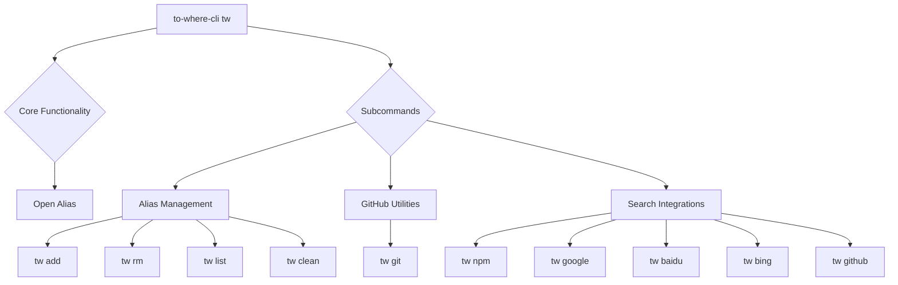

# Command Reference

This section serves as a comprehensive guide to all available commands within `to-where-cli`. It outlines the core functionality and categorizes subcommands, directing you to detailed sections for in-depth usage instructions, options, and expected outcomes for each command.

If you are new to `to-where-cli`, we recommend starting with the [Getting Started](./getting-started.md) guide to set up your environment.

## Command Structure Overview

The following diagram illustrates the main command and its various subcommands, categorized by their primary function:

## Available Commands

`to-where-cli` provides a set of commands designed to streamline your workflow:

| Command           | Description                                                        | Category              |
| :---------------- | :----------------------------------------------------------------- | :-------------------- |
| `tw [alias]`      | Opens the address associated with the specified alias in your browser. | Core Functionality    |
| `tw add`          | Adds a new alias, linking it to a URL or path.                     | Alias Management      |
| `tw rm`           | Removes an existing alias.                                         | Alias Management      |
| `tw list`         | Displays all currently stored aliases.                             | Alias Management      |
| `tw clean`        | Clears all stored aliases from your configuration.                 | Alias Management      |
| `tw git`          | Navigates to various sections of a GitHub repository.              | GitHub Utilities      |
| `tw npm`          | Performs a search for packages on npmjs.com.                       | Search Integrations   |
| `tw google`       | Performs a search using Google.                                    | Search Integrations   |
| `tw baidu`        | Performs a search using Baidu.                                     | Search Integrations   |
| `tw bing`         | Performs a search using Bing.                                      | Search Integrations   |
| `tw github`       | Performs a search on GitHub.com.                                   | Search Integrations   |

## Detailed Command Categories

For comprehensive details on each command and its specific usage, options, and examples, refer to the dedicated sub-sections:

### Alias Management

This section covers everything related to creating, listing, removing, and clearing your custom aliases. It provides step-by-step instructions and examples for managing your `to-where-cli` shortcuts effectively.

Learn more about [Alias Management](./command-reference-alias-management.md).

### GitHub Utilities

This section details the `tw git` command, which allows you to quickly navigate to different parts of a GitHub repository, such as issues, pull requests, branches, and project settings, directly from your terminal.

Learn more about [GitHub Utilities](./command-reference-github-utilities.md).

### Search Integrations

This section explains how to leverage `to-where-cli` to perform quick searches across various popular platforms, including npm, Google, Baidu, Bing, and GitHub, directly from your command line.

Learn more about [Search Integrations](./command-reference-search-integrations.md).

---

This Command Reference provides a structured overview of all functionalities available in `to-where-cli`. Explore the linked sub-sections for in-depth guidance on each command category to maximize your productivity. If you are interested in contributing to `to-where-cli`, see the [Development Guide](./development-guide.md).