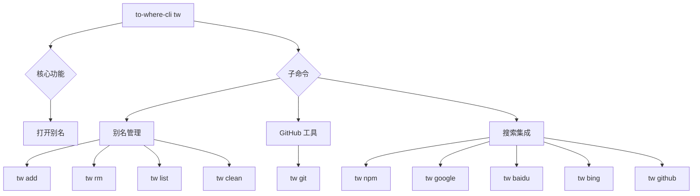

# 命令参考

本节全面介绍了 `to-where-cli` 中的所有可用命令。它概述了核心功能并对子命令进行了分类，引导您前往详细部分以获取每个命令的深入使用说明、选项和预期结果。

如果您是 `to-where-cli` 的新用户，建议您从[入门指南](./getting-started.md)开始，以设置您的环境。

## 命令结构概述

下图展示了主命令及其各种子命令，按其主要功能进行分类：

## 可用命令

`to-where-cli` 提供了一组旨在简化您的工作流程的命令：

| 命令           | 描述                                                       | 类别              |
| :---------------- | :----------------------------------------------------------------- | :-------------------- |
| `tw [别名]`      | 在浏览器中打开与指定别名关联的地址。 | 核心功能    |
| `tw add`          | 添加新别名，将其链接到 URL 或路径。                    | 别名管理      |
| `tw rm`           | 移除现有别名。                                         | 别名管理      |
| `tw list`         | 显示所有当前存储的别名。                             | 别名管理      |
| `tw clean`        | 从配置中清除所有存储的别名。                 | 别名管理      |
| `tw git`          | 导航到 GitHub 仓库的各个部分。              | GitHub 工具      |
| `tw npm`          | 在 npmjs.com 上搜索包。                       | 搜索集成   |
| `tw google`       | 使用 Google 执行搜索。                                    | 搜索集成   |
| `tw baidu`        | 使用百度执行搜索。                                     | 搜索集成   |
| `tw bing`         | 使用 Bing 执行搜索。                                    | 搜索集成   |
| `tw github`       | 在 GitHub.com 上执行搜索。                                   | 搜索集成   |

## 详细命令类别

有关每个命令及其具体用法、选项和示例的详细信息，请参阅专门的子部分：

### 别名管理

本节涵盖了创建、列出、移除和清除自定义别名的所有内容。它提供了管理 `to-where-cli` 快捷方式的分步说明和示例。

了解更多关于[别名管理](./command-reference-alias-management.md)。

### GitHub 工具

本节详细介绍了 `tw git` 命令，该命令允许您直接从终端快速导航到 GitHub 仓库的不同部分，例如问题、拉取请求、分支和项目设置。

了解更多关于[GitHub 工具](./command-reference-github-utilities.md)。

### 搜索集成

本节解释了如何利用 `to-where-cli` 直接从命令行在各种流行平台（包括 npm、Google、百度、Bing 和 GitHub）上执行快速搜索。

了解更多关于[搜索集成](./command-reference-search-integrations.md)。

---

本命令参考提供了 `to-where-cli` 中所有可用功能的结构化概述。探索链接的子部分，获取每个命令类别的深入指导，以最大限度地提高您的工作效率。如果您有兴趣为 `to-where-cli` 贡献代码，请参阅[开发指南](./development-guide.md)。