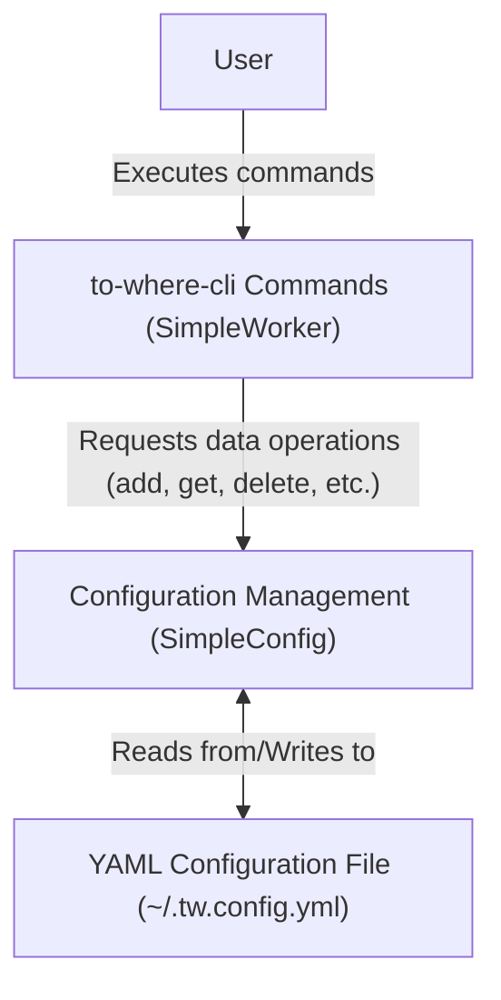

# Core Concepts

This section explains the fundamental concepts behind `to-where-cli`, detailing how it manages aliases, stores configurations, and the overall architecture that drives its operations. Understanding these core elements helps in effectively using and troubleshooting the tool.

For practical examples of managing your aliases, refer to the [Alias Management](./command-reference-alias-management.md) section.

## What are Aliases?

At its core, `to-where-cli` operates using a concept called "aliases." An alias is a simple, memorable name you assign to a specific file path or URL. This allows you to quickly navigate to frequently accessed locations without typing out the full address every time. Each alias is represented by a `Point` object, which has three main properties:

| Property | Type | Description |
|---|---|---|
| `alias` | `string` | A unique, user-defined name for the destination. This is the shorthand you use in `to-where-cli` commands. |
| `address` | `string` | The actual file path or URL that the `alias` points to. This is where `to-where-cli` will navigate or open. |
| `visits` | `number` | An optional counter that tracks how many times this alias has been used. This helps in identifying frequently used locations. |

When you use `to-where-cli`, you interact with these aliases. For example, you can add a new alias, open an existing one, delete an alias, or list all your stored aliases. The tool uses the `alias` to quickly retrieve its corresponding `address` and perform the desired action, such as opening a directory in your terminal or launching a URL in your browser.

## How Configurations are Stored

`to-where-cli` persists your aliases by storing them in a configuration file. This file acts as the central repository for all your defined `Point` objects. The tool uses a `SimpleConfig` class, which implements the `ConfigProtocol` interface, to handle all aspects of configuration management.

Key characteristics of the configuration storage include:

*   **YAML Format**: Configurations are stored in a human-readable YAML file. This makes it easy to inspect or even manually edit your configuration if needed.
*   **Default Location**: By default, the configuration file is named `.tw.config.yml` and is located in your user's home directory (`~`). You can also specify a custom path if required.
*   **Programmatic Access**: The `SimpleConfig` class provides methods for all standard CRUD (Create, Read, Update, Delete) operations on your configuration, ensuring data integrity and ease of management.

Here's an example of what your `.tw.config.yml` file might look like:

```yaml
points:
  - alias: my-project
    address: /Users/username/Documents/my-project-repo
    visits: 15
  - alias: docs
    address: https://docs.example.com
    visits: 8
  - alias: current-task
    address: ./src/features/new-feature
    visits: 3
```

This structure ensures that all your aliases are centrally managed and easily accessible by the `to-where-cli` application.

## System Architecture

The `to-where-cli` tool employs a clear architectural separation to manage user interactions and persistent data storage. This design ensures modularity and maintainability.

At a high level, the architecture consists of two main components:

1.  **SimpleWorker (`WorkerProtocol`)**: This component acts as the primary interface for user commands. When you execute a command like `tw add`, `tw open`, or `tw list`, the `SimpleWorker` processes your request. It handles the command-line arguments, applies any necessary logic (like path formatting or visit counting), and then interacts with the configuration management layer.
2.  **SimpleConfig (`ConfigProtocol`)**: This component is responsible for all data persistence. It manages reading from and writing to the `.tw.config.yml` file. The `SimpleConfig` provides a set of methods (defined by `ConfigProtocol`) that allow the `SimpleWorker` to perform operations like adding, deleting, updating, and retrieving aliases without needing to know the underlying storage mechanism.

This separation of concerns means that the `SimpleWorker` focuses solely on interpreting and executing commands, while the `SimpleConfig` handles the complexities of file I/O and data serialization. The `SimpleWorker` depends on and utilizes the `SimpleConfig` to perform its tasks.



This architectural setup ensures that `to-where-cli` is robust and scalable, clearly defining responsibilities for different parts of the application.

---

Understanding these core concepts provides a solid foundation for using and extending `to-where-cli` effectively. For practical examples and detailed usage instructions for each command, proceed to the [Command Reference](./command-reference.md) section.