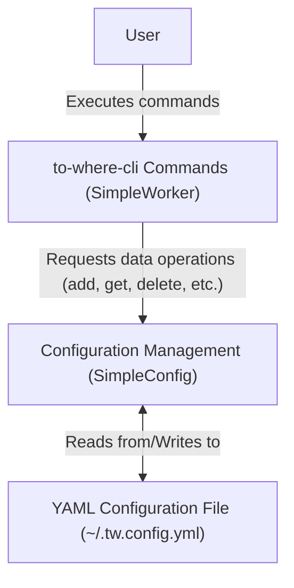

# 核心概念

本节解释了 `to-where-cli` 背后的基本概念，详细介绍了它如何管理别名、存储配置以及驱动其运行的整体架构。理解这些核心要素有助于有效使用和排查该工具的问题。

有关管理别名的实际示例，请参阅[别名管理](./command-reference-alias-management.md)部分。

## 什么是别名？

`to-where-cli` 的核心操作基于一个名为“别名”的概念。别名是你为特定文件路径或 URL 指定的一个简单易记的名称。这使你无需每次都输入完整的地址，即可快速导航到常用位置。每个别名都由一个 `Point` 对象表示，该对象具有三个主要属性：

| Property | Type | Description |
|---|---|---|
| `alias` | `string` | 目的地的唯一用户定义名称。这是你在 `to-where-cli` 命令中使用的简写。 |
| `address` | `string` | `alias` 指向的实际文件路径或 URL。`to-where-cli` 将导航到或打开此处。 |
| `visits` | `number` | 一个可选计数器，用于跟踪此别名已被使用了多少次。这有助于识别常用位置。 |

当你使用 `to-where-cli` 时，你将与这些别名进行交互。例如，你可以添加新别名、打开现有别名、删除别名或列出所有已存储的别名。该工具使用 `alias` 快速检索其对应的 `address` 并执行所需操作，例如在终端中打开目录或在浏览器中启动 URL。

## 配置的存储方式

`to-where-cli` 通过将你的别名存储在配置文件中来实现持久化。此文件充当所有已定义 `Point` 对象的中央存储库。该工具使用一个 `SimpleConfig` 类（实现了 `ConfigProtocol` 接口）来处理配置管理的所有方面。

配置存储的主要特点包括：

*   **YAML 格式**：配置以人类可读的 YAML 文件格式存储。这使得在需要时检查甚至手动编辑配置变得容易。
*   **默认位置**：默认情况下，配置文件名为 `.tw.config.yml`，位于用户主目录 (`~`) 中。如果需要，你也可以指定自定义路径。
*   **编程访问**：`SimpleConfig` 类为配置上的所有标准 CRUD（创建、读取、更新、删除）操作提供方法，确保数据完整性和易于管理。

以下是你的 `.tw.config.yml` 文件可能的样子：

```yaml
points:
  - alias: my-project
    address: /Users/username/Documents/my-project-repo
    visits: 15
  - alias: docs
    address: https://docs.example.com
    visits: 8
  - alias: current-task
    address: ./src/features/new-feature
    visits: 3
```

这种结构确保你的所有别名都由 `to-where-cli` 应用程序集中管理并易于访问。

## 系统架构

`to-where-cli` 工具采用清晰的架构分离来管理用户交互和持久数据存储。这种设计确保了模块化和可维护性。

从宏观角度看，该架构由两个主要组件组成：

1.  **SimpleWorker (`WorkerProtocol`)**：该组件充当用户命令的主要接口。当你执行 `tw add`、`tw open` 或 `tw list` 等命令时，`SimpleWorker` 会处理你的请求。它处理命令行参数，应用任何必要的逻辑（如路径格式化或访问计数），然后与配置管理层进行交互。
2.  **SimpleConfig (`ConfigProtocol`)**：该组件负责所有数据持久化。它管理对 `.tw.config.yml` 文件的读取和写入。`SimpleConfig` 提供了一组方法（由 `ConfigProtocol` 定义），允许 `SimpleWorker` 执行添加、删除、更新和检索别名等操作，而无需了解底层存储机制。

这种职责分离意味着 `SimpleWorker` 仅专注于解释和执行命令，而 `SimpleConfig` 则处理文件 I/O 和数据序列化的复杂性。`SimpleWorker` 依赖并利用 `SimpleConfig` 来执行其任务。



这种架构设置确保了 `to-where-cli` 具有健壮性和可扩展性，并明确定义了应用程序不同部分的职责。

---

理解这些核心概念为有效使用和扩展 `to-where-cli` 奠定了坚实基础。有关实际示例和每个命令的详细使用说明，请前往[命令参考](./command-reference.md)部分。