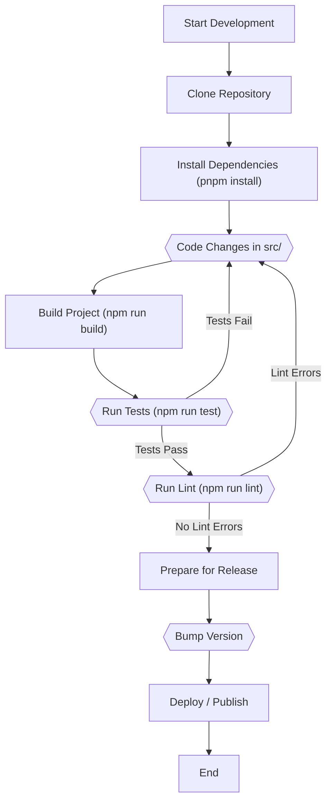

# Development Guide

This section provides guidance for developers interested in contributing to the `to-where-cli` project. It covers essential topics such as setting up your development environment, building the project, running tests, linting code, and understanding the release process.

For general information on using `to-where-cli`, refer to the [Getting Started](./getting-started.md) guide or the [Command Reference](./command-reference.md).

## Setting Up the Development Environment

To begin developing `to-where-cli`, you need to set up your local environment. Follow these steps to get started:

**Prerequisites:**

*   **Node.js**: Ensure you have Node.js installed on your system. `to-where-cli` is built on Node.js.
*   **pnpm**: This project primarily uses `pnpm` for package management. You can install it globally via `npm install -g pnpm` if you don't have it.

**Steps:**

1.  **Clone the repository**: Obtain the project source code by cloning the GitHub repository.

    ```bash
    git clone https://github.com/skypesky/to-where-cli.git
    ```

2.  **Navigate to the project directory**: Change your current directory to the cloned repository.

    ```bash
    cd to-where-cli
    ```

3.  **Install dependencies**: Install all required project dependencies using pnpm.

    ```bash
    pnpm install
    ```

## Building the Project

`to-where-cli` is a TypeScript project that uses `esbuild` for compilation. The build process generates the distributable JavaScript files in the `dist` directory.

| Script Name   | Command                   | Description                                         |
| :------------ | :------------------------ | :-------------------------------------------------- |
| `clean`       | `rimraf dist`             | Removes the `dist` directory.                       |
| `prebuild`    | `npm run clean`           | Runs before the `build` script to clean the `dist` folder. |
| `build`       | `node esbuild.config.cjs` | Compiles TypeScript source files to JavaScript.     |
| `build:watch` | `npm run build -- -w`     | Runs the build in watch mode, recompiling on file changes. |

**To build the project for production:**

```bash
npm run build
```

**To build and watch for changes during development:**

```bash
npm run build:watch
```

## Running Tests

Unit and integration tests for `to-where-cli` are managed with `Jest`. Running tests helps ensure that changes do not introduce regressions and that new features function as expected.

| Script Name | Command                           | Description                                            |
| :---------- | :-------------------------------- | :----------------------------------------------------- |
| `test`      | `jest --forceExit --detectOpenHandles` | Executes all tests and exits cleanly.                  |
| `coverage`  | `npm run test -- --coverage`      | Runs tests and generates a code coverage report.       |

**To run all tests:**

```bash
npm run test
```

**To generate a test coverage report:**

```bash
npm run coverage
```

Test configurations are defined in `jest.config.js` and `tsconfig.json` in the project root.

## Linting Code

Linting ensures code quality and consistency across the project. `to-where-cli` uses `ESLint` for static code analysis.

| Script Name | Command              | Description                                        |
| :---------- | :------------------- | :------------------------------------------------- |
| `lint`      | `eslint src/**/*.ts` | Checks `src` directory for linting errors.         |
| `lint:fix`  | `npm run lint -- --fix` | Attempts to automatically fix linting issues.      |

**To check for linting errors:**

```bash
npm run lint
```

**To automatically fix fixable linting errors:**

```bash
npm lint:fix
```

## Release Process

Understanding the release process is crucial for contributing to the project, especially when preparing new versions or deploying changes.

### Version Bumping

The project uses `ver-bump` for standard version increments.

```bash
npm run bump-version
```

Additionally, `to-where-cli` has a custom script to generate beta versions for pre-release testing. This script appends a timestamp-based beta suffix to the current version.

**Example Beta Version Format**: `0.0.23-beta-YYYY-MM-DD-HH-mm-SSS`

This script automatically updates the `version` field in the `package.json` file. The `WorkSpaces` utility within the `scripts/libs` directory handles this version updating logic.

### Deployment

Deployment scripts are available for installing `to-where-cli` globally, either from your local build or directly from the npm registry.

| Script Name    | Command                                      | Description                                                 |
| :------------- | :------------------------------------------- | :---------------------------------------------------------- |
| `deploy`       | `npm run build && npm uninstall -g to-where-cli && npm install -g . -f` | Builds the project, then uninstalls any existing global `to-where-cli` and installs the local build globally. |
| `deploy:remote` | `npm uninstall -g to-where-cli && npm install -g to-where-cli` | Uninstalls any existing global `to-where-cli` and installs the latest version from the npm registry globally. |
| `show:version` | `npm show to-where-cli version`              | Displays the current version of `to-where-cli` published on npm. |

## Development Workflow Overview

The typical development workflow involves iterating through coding, building, testing, and linting. Here is a high-level overview:



This guide provides the necessary information to get started with developing `to-where-cli`. Familiarizing yourself with these processes will help ensure smooth contributions.

For common issues that might arise during development or usage, refer to the [Troubleshooting](./troubleshooting.md) section. To see recent changes and upcoming features, check the [Release Notes](./release-notes.md).