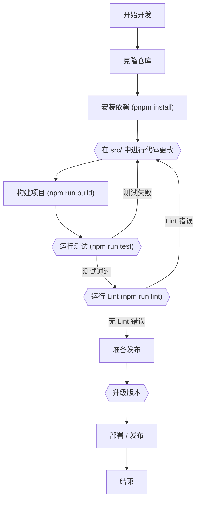

# 开发指南

本节为有兴趣为 `to-where-cli` 项目做出贡献的开发人员提供指导。它涵盖了设置开发环境、构建项目、运行测试、代码 Lint 和理解发布流程等基本主题。

有关使用 `to-where-cli` 的一般信息，请参阅 [入门指南](./getting-started.md) 或 [命令参考](./command-reference.md)。

## 设置开发环境

要开始开发 `to-where-cli`，您需要设置本地环境。请按照以下步骤开始：

**先决条件：**

*   **Node.js**: 确保您的系统上安装了 Node.js。`to-where-cli` 是基于 Node.js 构建的。
*   **pnpm**: 本项目主要使用 `pnpm` 进行包管理。如果您没有安装，可以通过 `npm install -g pnpm` 全局安装。

**步骤：**

1.  **克隆仓库**：通过克隆 GitHub 仓库获取项目源代码。

    ```bash
    git clone https://github.com/skypesky/to-where-cli.git
    ```

2.  **导航到项目目录**：将当前目录更改为克隆的仓库。

    ```bash
    cd to-where-cli
    ```

3.  **安装依赖**：使用 pnpm 安装所有必需的项目依赖。

    ```bash
    pnpm install
    ```

## 构建项目

`to-where-cli` 是一个 TypeScript 项目，使用 `esbuild` 进行编译。构建过程会在 `dist` 目录中生成可分发的 JavaScript 文件。

| Script Name   | Command                   | Description                                         |
| :------------ | :------------------------ | :-------------------------------------------------- |
| `clean`       | `rimraf dist`             | 删除 `dist` 目录。                                  |
| `prebuild`    | `npm run clean`           | 在 `build` 脚本运行之前执行，用于清理 `dist` 文件夹。 |
| `build`       | `node esbuild.config.cjs` | 将 TypeScript 源文件编译为 JavaScript。             |
| `build:watch` | `npm run build -- -w`     | 在监视模式下运行构建，文件更改时重新编译。            |

**要构建生产项目：**

```bash
npm run build
```

**要在开发过程中构建并监视更改：**

```bash
npm run build:watch
```

## 运行测试

`to-where-cli` 的单元测试和集成测试由 `Jest` 管理。运行测试有助于确保更改不会引入回归，并且新功能按预期运行。

| Script Name | Command                           | Description                                            |
| :---------- | :-------------------------------- | :----------------------------------------------------- |
| `test`      | `jest --forceExit --detectOpenHandles` | 执行所有测试并干净退出。                               |
| `coverage`  | `npm run test -- --coverage`      | 运行测试并生成代码覆盖率报告。                         |

**运行所有测试：**

```bash
npm run test
```

**生成测试覆盖率报告：**

```bash
npm run coverage
```

测试配置在项目根目录的 `jest.config.js` 和 `tsconfig.json` 中定义。

## 代码 Lint

Lint 确保项目中的代码质量和一致性。`to-where-cli` 使用 `ESLint` 进行静态代码分析。

| Script Name | Command              | Description                                        |
| :---------- | :------------------- | :------------------------------------------------- |
| `lint`      | `eslint src/**/*.ts` | 检查 `src` 目录中的 Lint 错误。                    |
| `lint:fix`  | `npm run lint -- --fix` | 尝试自动修复 Lint 问题。                           |

**检查 Lint 错误：**

```bash
npm run lint
```

**自动修复可修复的 Lint 错误：**

```bash
npm lint:fix
```

## 发布流程

理解发布流程对于为项目做贡献至关重要，尤其是在准备新版本或部署更改时。

### 版本升级

项目使用 `ver-bump` 进行标准版本递增。

```bash
npm run bump-version
```

此外，`to-where-cli` 有一个自定义脚本，用于生成 Beta 版本以进行预发布测试。此脚本会将基于时间戳的 Beta 后缀附加到当前版本。

**示例 Beta 版本格式**：`0.0.23-beta-YYYY-MM-DD-HH-mm-SSS`

此脚本会自动更新 `package.json` 文件中的 `version` 字段。`scripts/libs` 目录中的 `WorkSpaces` 工具处理此版本更新逻辑。

### 部署

部署脚本可用于全局安装 `to-where-cli`，无论是从本地构建还是直接从 npm registry 安装。

| Script Name    | Command                                      | Description                                                 |
| :------------- | :------------------------------------------- | :---------------------------------------------------------- |
| `deploy`       | `npm run build && npm uninstall -g to-where-cli && npm install -g . -f` | 构建项目，然后卸载任何现有的全局 `to-where-cli` 并全局安装本地构建版本。 |
| `deploy:remote` | `npm uninstall -g to-where-cli && npm install -g to-where-cli` | 卸载任何现有的全局 `to-where-cli` 并全局安装 npm registry 中的最新版本。 |
| `show:version` | `npm show to-where-cli version`              | 显示发布到 npm 上的 `to-where-cli` 的当前版本。             |

## 开发工作流程概览

典型的开发工作流程包括代码编写、构建、测试和 Lint 的迭代过程。以下是高级概述：



本指南提供了开始开发 `to-where-cli` 所需的信息。熟悉这些流程将有助于确保顺利的贡献。

有关开发或使用过程中可能出现的常见问题，请参阅 [故障排除](./troubleshooting.md) 部分。要查看最近的更改和即将推出的功能，请查阅 [发布说明](./release-notes.md)。