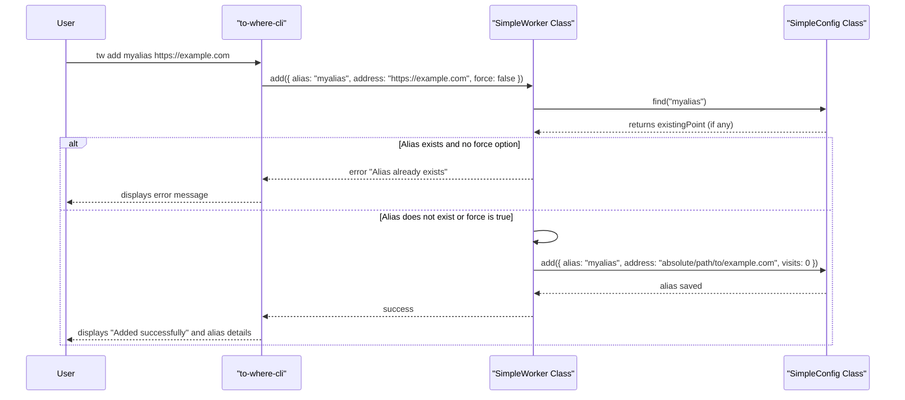
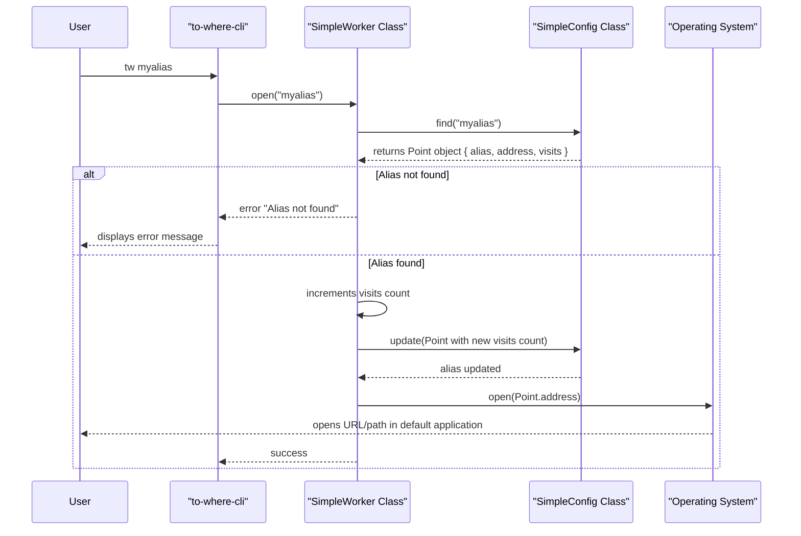

# Getting Started

This section guides you through the initial setup of `to-where-cli`, covering its installation and providing a minimal working example to quickly demonstrate its basic functionality. For a comprehensive overview of all commands and their options, refer to the [Command Reference](./command-reference.md) section.

## Installation

`to-where-cli` is distributed as an npm package and can be installed globally using the following command:

```shell
npm install -g to-where-cli
```

Currently, `to-where-cli` officially supports [macOS](https://en.wikipedia.org/wiki/MacOS) and [Windows](https://en.wikipedia.org/wiki/Windows) operating systems.

## Basic Usage

`to-where-cli` simplifies opening hard-to-remember URLs by using aliases. Once installed, the primary command is `tw`. Here are the fundamental operations to get you started:

### Add an Alias

Use the `add` command to assign a memorable alias to any URL or file path. If the address is omitted, it defaults to your current working directory.

```shell
tw add <alias> [address]
```

**Parameters**

| Name | Type | Description |
|---|---|---|
| `alias` | `string` | The short, memorable name you want to assign to your address. |
| `address` | `string` | The URL or file path you want to open. If omitted, the current working directory is used. |

**Options**

| Name | Type | Description |
|---|---|---|
| `-f, --force` | `boolean` | Overwrite an existing alias if it already exists. Defaults to `false`. |

**Examples:**

- Add an alias named `home` for your GitHub profile:

```shell
tw add home https://github.com/skypesky
```

- Add an alias named `project` for your current directory (when `address` is omitted):

```shell
tw add project
```

- Update an existing alias named `home` to a new address, forcing the overwrite:

```shell
tw add home https://github.com/skypesky/leetcode-for-javascript -f
```

### Open an Alias

Once an alias is added, simply type `tw` followed by the alias to open the associated address.

```shell
tw <alias>
```

**Example:**

- Open the address associated with the `home` alias:

```shell
tw home
```

### List Aliases

To view your existing aliases, use the `ls` (list) command. You can list all aliases or specify a particular one.

```shell
tw ls [alias]
```

**Example:**

- List all existing aliases:

```shell
tw ls
```

- List details for a specific alias named `home`:

```shell
tw ls home
```

### Remove an Alias

To delete an alias, use the `rm` (remove) command.

```shell
tw rm <alias>
```

**Example:**

- Remove the `home` alias:

```shell
tw rm home
```

### Show Help Information

For a quick reference of available commands and options, use the help flag.

```shell
tw -h
```

## How It Works: Adding an Alias

The following sequence diagram illustrates the process when you use the `tw add` command:



## How It Works: Opening an Alias

When you execute `tw <alias>`, the following steps occur to open the associated address:



## What's Next?

You've now learned how to install `to-where-cli` and perform basic operations. To dive deeper into how `to-where-cli` manages aliases and its underlying architecture, proceed to the [Core Concepts](./core-concepts.md) section. For a complete list and detailed explanation of all available commands, refer to the [Command Reference](./command-reference.md).