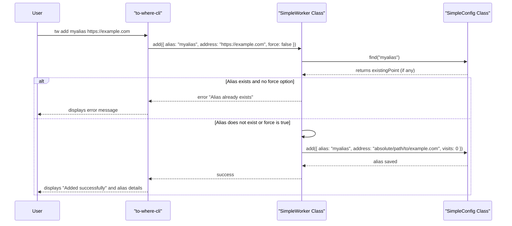
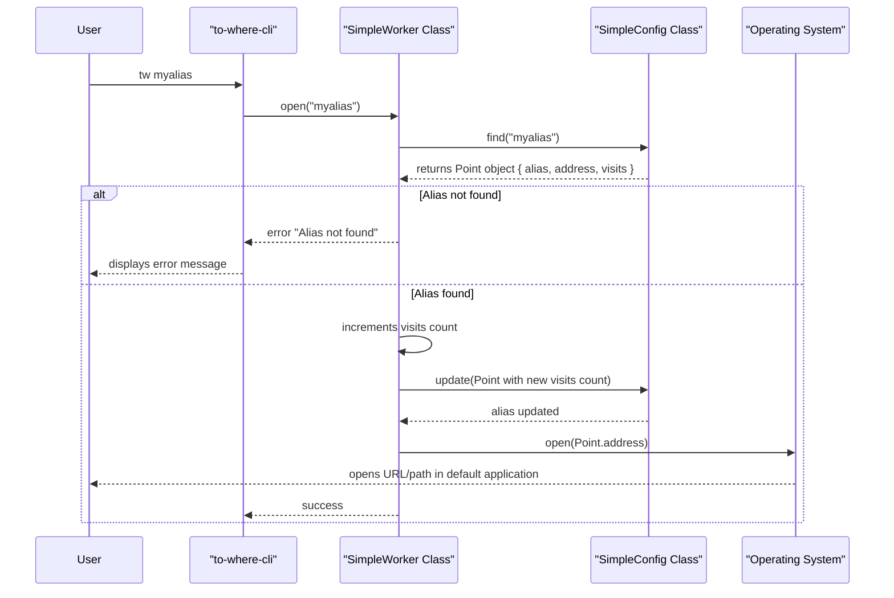

# 入门

本节将指导您完成 `to-where-cli` 的初始设置，包括其安装和提供一个最小工作示例，以快速演示其基本功能。有关所有命令及其选项的全面概述，请参阅[命令参考](./command-reference.md)部分。

## 安装

`to-where-cli` 作为 npm 包分发，可以使用以下命令进行全局安装：

```shell
npm install -g to-where-cli
```

目前，`to-where-cli` 正式支持 [macOS](https://en.wikipedia.org/wiki/MacOS) 和 [Windows](https://en.wikipedia.org/wiki/Windows) 操作系统。

## 基本用法

`to-where-cli` 通过使用别名来简化打开难以记住的 URL。安装后，主要命令是 `tw`。以下是帮助您入门的基本操作：

### 添加别名

使用 `add` 命令为任何 URL 或文件路径分配一个易于记忆的别名。如果省略地址，则默认为您当前的工作目录。

```shell
tw add <alias> [address]
```

**参数**

| Name | Type | Description |
|---|---|---|
| `alias` | `string` | 您想要分配给地址的简短、易记的名称。 |
| `address` | `string` | 您想要打开的 URL 或文件路径。如果省略，则使用当前工作目录。 |

**选项**

| Name | Type | Description |
|---|---|---|
| `-f, --force` | `boolean` | 如果别名已存在，则覆盖现有别名。默认为 `false`。 |

**示例：**

- 为您的 GitHub 个人资料添加一个名为 `home` 的别名：

```shell
tw add home https://github.com/skypesky
```

- 为您的当前目录添加一个名为 `project` 的别名（当 `address` 省略时）：

```shell
tw add project
```

- 将名为 `home` 的现有别名更新为新地址，强制覆盖：

```shell
tw add home https://github.com/skypesky/leetcode-for-javascript -f
```

### 打开别名

添加别名后，只需键入 `tw` 后跟别名即可打开关联的地址。

```shell
tw <alias>
```

**示例：**

- 打开与 `home` 别名关联的地址：

```shell
tw home
```

### 列出别名

要查看您现有的别名，请使用 `ls`（列表）命令。您可以列出所有别名或指定特定的别名。

```shell
tw ls [alias]
```

**示例：**

- 列出所有现有别名：

```shell
tw ls
```

- 列出名为 `home` 的特定别名的详细信息：

```shell
tw ls home
```

### 删除别名

要删除别名，请使用 `rm`（删除）命令。

```shell
tw rm <alias>
```

**示例：**

- 删除 `home` 别名：

```shell
tw rm home
```

### 显示帮助信息

有关可用命令和选项的快速参考，请使用帮助标志。

```shell
tw -h
```

## 工作原理：添加别名

以下序列图说明了您使用 `tw add` 命令时的过程：



## 工作原理：打开别名

当您执行 `tw <alias>` 时，会发生以下步骤来打开关联的地址：



## 接下来？

您现在已经学习了如何安装 `to-where-cli` 并执行基本操作。要深入了解 `to-where-cli` 如何管理别名及其底层架构，请继续阅读[核心概念](./core-concepts.md)部分。有关所有可用命令的完整列表和详细说明，请参阅[命令参考](./command-reference.md)。