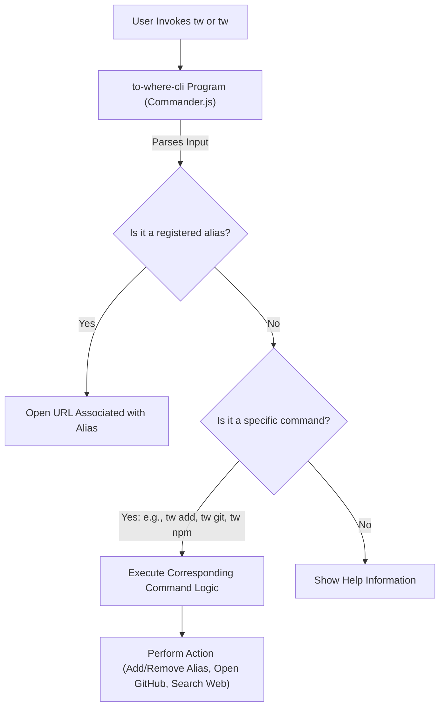

# Overview

`to-where-cli` is a command-line interface (CLI) tool that helps you quickly open hard-to-remember or frequently used URLs using simple aliases. It streamlines your workflow by allowing you to navigate directly to websites, specific GitHub repository pages, or search results on popular platforms, all from your terminal.

Currently, `to-where-cli` is designed to run on [macOS](https://en.wikipedia.org/wiki/MacOS) and [Windows](https://en.wikipedia.org/wiki/Windows) operating systems.

## Key Features

`to-where-cli` provides a set of features to enhance your command-line experience:

*   **Alias Management**: Define and manage custom aliases for any URL.
*   **GitHub Repository Navigation**: Directly open various sections of a GitHub repository, such as issues, pull requests, or the repository's main page.
*   **Integrated Search**: Perform quick searches on popular platforms like npm, Google, Bing, Baidu, and GitHub.

## How `to-where-cli` Works

At its core, `to-where-cli` uses a straightforward mechanism based on the `commander.js` library to parse your commands and aliases. When you invoke `tw`, the program first checks if you've provided an alias. If an alias exists, it opens the corresponding URL. Otherwise, it processes dedicated commands for specific actions like adding new aliases, listing existing ones, or initiating searches.

Here's a high-level overview of the `to-where-cli` architecture:

## Documentation Structure

This documentation is organized to help you quickly find the information you need:

*   **Getting Started** (`/getting-started`): Learn how to install `to-where-cli` and run your first commands.
*   **Core Concepts** (`/core-concepts`): Understand the fundamental ideas behind `to-where-cli`, including alias management.
*   **Command Reference** (`/command-reference`): A detailed guide to all available commands, broken down into specific sections for alias management, GitHub utilities, and search integrations.
*   **Development Guide** (`/development-guide`): For those interested in contributing or building upon `to-where-cli`.
*   **Troubleshooting** (`/troubleshooting`): Find solutions to common issues.
*   **Release Notes** (`/release-notes`): Track changes and new features across versions.

---

To begin using `to-where-cli`, proceed to the [Getting Started](./getting-started.md) section.