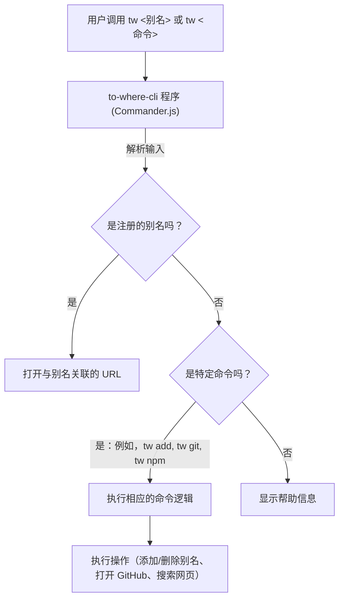

# 概览

`to-where-cli` 是一个命令行界面 (CLI) 工具，可帮助您使用简单的别名快速打开难以记忆或经常使用的 URL。它允许您直接从终端导航到网站、特定的 GitHub 仓库页面或流行平台上的搜索结果，从而简化您的工作流程。

目前，`to-where-cli` 旨在 [macOS](https://en.wikipedia.org/wiki/MacOS) 和 [Windows](https://en.wikipedia.org/wiki/Windows) 操作系统上运行。

## 主要功能

`to-where-cli` 提供一系列功能来增强您的命令行体验：

*   **别名管理**：为任何 URL 定义和管理自定义别名。
*   **GitHub 仓库导航**：直接打开 GitHub 仓库的各个部分，例如问题、拉取请求或仓库主页。
*   **集成搜索**：在 npm、Google、Bing、百度和 GitHub 等流行平台上执行快速搜索。

## `to-where-cli` 的工作原理

`to-where-cli` 的核心是基于 `commander.js` 库的一种直接机制，用于解析您的命令和别名。当您调用 `tw` 时，程序首先检查您是否提供了别名。如果别名存在，它会打开相应的 URL。否则，它会处理用于特定操作的专用命令，例如添加新别名、列现有别名或启动搜索。

以下是 `to-where-cli` 架构的高级概述：

## 文档结构

本文档的组织旨在帮助您快速找到所需信息：

*   **入门** (`/getting-started`)：了解如何安装 `to-where-cli` 并运行您的第一个命令。
*   **核心概念** (`/core-concepts`)：了解 `to-where-cli` 背后的基本思想，包括别名管理。
*   **命令参考** (`/command-reference`)：所有可用命令的详细指南，分为别名管理、GitHub 工具和搜索集成等特定部分。
*   **开发指南** (`/development-guide`)：适用于对贡献或基于 `to-where-cli` 进行开发感兴趣的人员。
*   **故障排除** (`/troubleshooting`)：查找常见问题的解决方案。
*   **发布说明** (`/release-notes`)：跟踪各个版本中的更改和新功能。

---

要开始使用 `to-where-cli`，请前往 [入门](./getting-started.md) 部分。